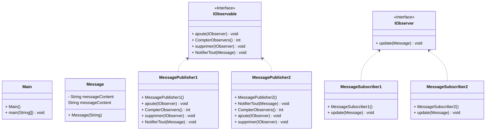

```mermaid
classDiagram
direction BT
class IObservable {
<<Interface>>
  + ajoute(IObserver) void
  + CompterObservers() int
  + supprimer(IObserver) void
  + NotifierTout(Message) void
}
class IObserver {
<<Interface>>
  + update(Message) void
}
class Main {
  + Main() 
  + main(String[]) void
}
class Message {
  + Message(String) 
  - String messageContent
   String messageContent
}
class MessagePublisher1 {
  + MessagePublisher1() 
  + ajoute(IObserver) void
  + CompterObservers() int
  + supprimer(IObserver) void
  + NotifierTout(Message) void
}
class MessagePublisher2 {
  + MessagePublisher2() 
  + NotifierTout(Message) void
  + CompterObservers() int
  + ajoute(IObserver) void
  + supprimer(IObserver) void
}
class MessageSubscriber1 {
  + MessageSubscriber1() 
  + update(Message) void
}
class MessageSubscriber2 {
  + MessageSubscriber2() 
  + update(Message) void
}

MessagePublisher1  ..>  IObservable 
MessagePublisher2  ..>  IObservable 
MessageSubscriber1  ..>  IObserver 
MessageSubscriber2  ..>  IObserver
```
